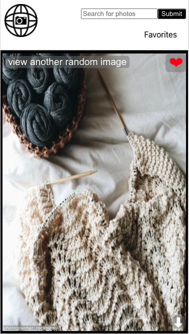

# Wall-i

A [Front-End Project](https://frontend.turing.edu/projects/module-3/niche-audience.html) by [Jeff Shepherd](https://github.com/JeffShepherd).

1. [Overview](#overview)
2. [Planning Resources](#planning-resources)
3. [Set Up](#setup-instructions)
4. [Learning Goals](#learning-goals)
5. [Technologies](#technologies)
6. [Features](#features)
7. [Challenges](#challenges)
8. [Wins](#wins)
9. [Future Additions](#future-iterations)


## Overview

_Wall-i_ is the [Turing School of Software and Design](https://turing.io/) Module 3 final solo project. The challenge of this project: work within constraints to deliver a product for your niche audience, which helps solve a problem unique to them.

Given this challenge, I decided to create an application for finding, and downloading, awesome wallpapers for any devics. I chose this as I had always wished there was a simple app that accomplishes this goal. Wall-i allows a user to view random photos, as well as search by a specific topic. It also lets a user favorite any photo they see, and return to a list of their favorite photos at any time. If a user wishes to use the photo as the wallpaper, they can click the download link available on every photo.

To create this application, I leveraged React, React Router, JavaScript, HTML, and CSS to create the front-end. As I worked, I also used Cypress for test-driven development of our application.


## Planning Resources

* [GitHub Project Board](https://github.com/JeffShepherd/Wall-i/projects/1)
* [Miro Board - Wireframes](https://miro.com/app/board/o9J_lI88SmI=/)


## Setup Instructions


Clone down this repository to your local machine:

```
git clone git@github.com:JeffShepherd/Wall-i.git
```

CD into the new directory:

```
cd Wall-i
```

Create a .env file for the API key (***please reach out to me for the key***):

```
touch .env
```

Then install the library dependencies by running:

```
npm install
```

To start application, run:

```
npm start
```

If you see `Compiled successfully!` in your terminal, the application is running and the app can be veiwed at `http://localhost:3000/` in your browser.


## Learning Goals
Demonstrate mastery of the following:
* React
* Router
* Asynchronous JavaScript
* End to end testing with Cypress


## Technologies


---
## Features

#### Landing Page Demo


#### Favoriting Demo


#### Mobile View




---
## Challenges

* Completing the project in a short time frame while interviewing and dealing with family emergencies
* Deploying for the first time using environment variables
* Unclear documentation for specific API features


---
## Wins

* Completing the project in a short time frame while interviewing and dealing with family emergencies
* Achieving elegant simplicity in design (as a non-designer)
* Figuring out how to force a download of a photo on-click
* Confidence with Cypress testing


---
## Future Iterations

* Display additional search results (pagination)
* Allow search results to scroll over a static landing page view

